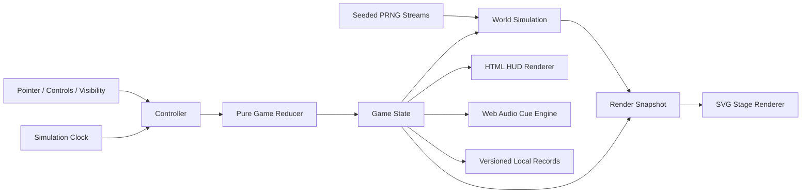

# Where's Mitch? — Technical Specification

**Version:** v1 planning contract  
**Date:** 2026-07-31

## 1. Architecture Decision

Use strict TypeScript ES modules for maintainable source code, then bundle them into a single
classic browser IIFE with esbuild. Render the game world as inline SVG controlled by a small,
time-based simulation; render menus and HUD controls as semantic HTML styled with CSS.

The result is framework-free and runtime-dependency-free while still supporting modular source,
unit tests, type checking, and direct `file://` execution.

### Explicitly Rejected For v1

| Option | Reason |
|--------|--------|
| React/Vue/Svelte | State/rendering scope is too small and the game is not an SPA |
| Phaser/PixiJS | Adds a runtime engine for behavior SVG/DOM already handles |
| Canvas-only renderer | Manual hit testing and code-drawn iteration are worse for this vector game |
| Runtime ESM | Direct `file://` module loading fails browser CORS/security rules |
| External asset CDN | Breaks offline guarantee and adds availability/privacy dependencies |
| Service worker/PWA | Adds cache invalidation and origin-only behavior without core value |

## 2. Supported Environment

- Development runtime: Node.js 24 LTS and npm.
- Browser target: current stable Chrome, Edge, Firefox, and Safari.
- Language target: ES2020 syntax/APIs after bundling.
- Primary layouts: desktop 1024×640 and larger; mobile landscape down to 667×375 CSS pixels.
- Production runtime: static local files or static HTTP(S); no Node process or server function.

Dependency versions are resolved and pinned by `package-lock.json` when Phase 1 initializes the
project. Do not use floating CDN versions.

## 3. Toolchain

### Runtime Dependencies

None.

### Development Dependencies

- `typescript` — strict types and `tsc --noEmit` verification.
- `esbuild` — bundles browser source with `platform: "browser"`, `format: "iife"`, and no
  external imports.
- `vitest` — deterministic unit tests for pure rules and algorithms.
- `@playwright/test` — browser, touch, visual, hosted, and direct-file E2E.
- `eslint` plus TypeScript support — correctness linting, not stylistic churn.
- `prettier` — TypeScript, CSS, HTML, JSON, and Markdown formatting.

No dependency may be added to solve a task that is straightforward with the platform APIs.

## 4. Target Repository Shape

```text
.
├── AGENTS.md
├── HANDOFF.md
├── README.md
├── LICENSE
├── package.json
├── package-lock.json
├── tsconfig.json
├── eslint.config.js
├── .prettierrc.json
├── playwright.config.ts
├── scripts/
│   ├── build.mjs
│   ├── dev.mjs
│   └── package-release.mjs
├── public/
│   ├── index.html
│   ├── styles.css
│   ├── favicon.svg
│   ├── 404.html
│   └── _headers
├── src/
│   ├── main.ts
│   ├── core/
│   │   ├── clock.ts
│   │   ├── difficulty.ts
│   │   ├── events.ts
│   │   ├── reducer.ts
│   │   ├── rng.ts
│   │   └── types.ts
│   ├── game/
│   │   ├── controller.ts
│   │   ├── input.ts
│   │   ├── records.ts
│   │   └── visibility.ts
│   ├── world/
│   │   ├── actor.ts
│   │   ├── behaviors.ts
│   │   ├── difficulty-profile.ts
│   │   ├── mitch.ts
│   │   ├── path-network.ts
│   │   ├── scene.ts
│   │   └── scene-selector.ts
│   ├── scenes/
│   │   ├── washington.ts
│   │   ├── kentucky-fair.ts
│   │   └── airport.ts
│   ├── render/
│   │   ├── art/
│   │   ├── cutscenes/
│   │   ├── svg-dom.ts
│   │   ├── stage-renderer.ts
│   │   └── ui-renderer.ts
│   ├── audio/
│   │   ├── audio-engine.ts
│   │   └── cues.ts
│   └── storage/
│       ├── schema.ts
│       └── storage.ts
├── tests/
│   ├── unit/
│   ├── e2e/
│   └── fixtures/
├── dist/                 # generated, never hand-edited
├── docs/
└── .planning/
```

Exact file splitting may adjust when implementation reveals a smaller coherent boundary, but the
core/rules, world/simulation, render, audio, and storage boundaries remain separate. The phase plans
create this tree incrementally; later-scene, audio, storage, and release files are not Phase 1 work.

## 5. Build Contract

`scripts/build.mjs` performs these operations in order:

1. Validate that `dist/` resolves inside the repository before clearing it.
2. Create a fresh `dist/`.
3. Bundle `src/main.ts` to `dist/game.js` with:
   - `bundle: true`
   - `platform: "browser"`
   - `format: "iife"`
   - `target: ["es2020"]`
   - no external dependencies
   - development sourcemap only
   - production minification only
4. Copy `public/index.html`, `styles.css`, `favicon.svg`, `404.html`, and `_headers` unchanged.
5. Scan generated HTML/CSS/JS for absolute-root URLs, `type="module"`, remote URLs, dynamic
   imports, and source references outside `dist/`; fail if found.
6. Emit a build summary containing file names and byte sizes.

`public/index.html` references only relative paths:

```html
<link rel="stylesheet" href="./styles.css">
<script defer src="./game.js"></script>
```

The release artifact is the contents of `dist/`, not the source tree.

## 6. Commands Contract

```text
npm run dev             build/watch and serve with a tiny Node-only local static server
npm run build           clean deterministic production build
npm run typecheck       tsc --noEmit
npm run lint            ESLint over source, scripts, and tests
npm run format          Prettier write
npm run format:check    Prettier check
npm run test            Vitest watch
npm run test:run        Vitest one-shot
npm run test:e2e        Playwright hosted tests
npm run test:file       Playwright direct file:// smoke tests
npm run package         build and create a versioned static ZIP
npm run verify          typecheck + lint + format check + unit + build + E2E + file smoke
```

The tiny development server uses Node built-ins and is development-only. The game must remain
fully functional without it after `npm run build`.

## 7. Runtime Component Boundaries



- **Controller:** Owns the animation loop and dispatch ordering; contains no SVG drawing.
- **Reducer:** Pure state transitions for attempts, scoring, pause, win/loss, and round changes.
- **World:** Deterministically advances actors, routes, hiding, and ambient systems.
- **Renderers:** Apply snapshots to existing DOM/SVG nodes and dispatch no business mutation.
- **Audio:** Reacts to semantic cues and never controls state progression.
- **Storage:** Persists validated records/settings, never live simulation state.

## 8. Core Type Contracts

Representative TypeScript contracts:

```ts
type GameMode =
  | "boot"
  | "title"
  | "round_intro"
  | "playing"
  | "paused"
  | "player_capture"
  | "round_transition"
  | "mitch_escape"
  | "game_over";

interface GameState {
  mode: GameMode;
  runSeed: number;
  round: number;
  completedRounds: number;
  clicksRemaining: number;
  totalAttempts: number;
  roundStartedAtMs: number | null;
  visibleRoundElapsedMs: number;
  sceneId: SceneId | null;
  sceneSeed: number | null;
  soundEnabled: boolean;
  motionMode: "system" | "reduce" | "full";
}

type GameEvent =
  | { type: "START_RUN"; runSeed: number }
  | { type: "ROUND_READY"; sceneId: SceneId; sceneSeed: number }
  | { type: "MISS"; x: number; y: number }
  | { type: "MITCH_CAUGHT" }
  | { type: "CAPTURE_COMPLETE" }
  | { type: "ESCAPE_COMPLETE" }
  | { type: "PAUSE" }
  | { type: "RESUME" }
  | { type: "RESTART" }
  | { type: "SET_SOUND"; enabled: boolean }
  | { type: "SET_MOTION"; mode: "system" | "reduce" | "full" };

interface DifficultyProfile {
  crowdCount: number;
  crowdSpeed: number;
  mitchSpeed: number;
  routeDecisionMs: number;
  dwellMs: number;
  peekMs: number;
  maxHiddenMs: number;
  hitboxScale: number;
}

interface SceneTemplate {
  id: SceneId;
  title: string;
  create(seed: number, difficulty: DifficultyProfile): SceneInstance;
}

interface SceneInstance {
  routeNetwork: PathNetwork;
  hideSpots: HideSpot[];
  actors: Actor[];
  ambientSystems: AmbientSystem[];
  staticModel: SceneStaticModel;
}

interface HideSpot {
  id: string;
  position: Vec2;
  approachNodeId: string;
  occluderId: string;
  revealRatio: number;
  weight: number;
}
```

Names may adjust, but these semantics and separation are locked.

`PAUSE` and `RESUME` represent the player's explicit pause state. Document visibility is a
controller/clock suspension signal: it does not overwrite `GameState.mode`. When a visible playing
page returns, the controller holds suspension through the canonical READY — SET — FIND! countdown;
when a manually paused page returns, it remains paused.

## 9. Seeded Randomness

- Implement one small, reviewed 32-bit deterministic PRNG such as Mulberry32.
- The root run seed is unsigned 32-bit.
- Derive named sub-seeds with a stable hash: `scene-selection`, `round-N-scene`, `round-N-crowd`,
  `round-N-mitch`, and `round-N-ambient`.
- Gameplay code never calls `Math.random()`.
- `crypto.getRandomValues` is used only to create a new root seed; timestamp/performance values are
  fallback entropy if unavailable.
- `?seed=<uint32>` overrides root seed for debugging and E2E.
- `?scene=washington|fair|airport` may constrain a test round without changing normal selection.

## 10. Animation And Time

- One `requestAnimationFrame` loop owns simulation and render order.
- Use the callback timestamp, never a presumed 60 Hz frame count.
- Clamp a single simulation delta to 50 ms to avoid tab-resume jumps.
- Long cutscene timelines derive positions from elapsed timeline time, not chained `setTimeout`.
- The world update creates an immutable or readonly `RenderSnapshot`; renderers update transforms,
  visibility, and text only.
- Transient particles/effects are pooled; the hot path creates no DOM nodes or arrays proportional
  to actor count.
- The page visibility handler suspends the clock; no catch-up simulation occurs.

## 11. SVG Rendering

### Stage

- Logical coordinate system: `viewBox="0 0 1440 900"`.
- Root SVG uses `preserveAspectRatio="xMidYMid meet"`.
- Semantic HTML surrounds the SVG; SVG itself is `aria-hidden="true"` because the search target
  cannot be meaningfully exposed as an accessible list without defeating gameplay.

### Persistent Layers

1. `background-layer`
2. `far-ambient-layer`
3. `back-actor-layer`
4. `target-and-actor-layer`
5. `front-occluder-layer`
6. `effects-layer`
7. `cutscene-layer`

Actors are SVG `<g>` elements. Movement updates one group transform. Limb/face idle details use CSS
classes or child transforms. Static geometry is constructed once per round.

### Depth And Occlusion

- Actors carry discrete authored depth lanes; avoid re-sorting the whole DOM every frame.
- Movements crossing lanes do so only at designated portals and update parent layer at transition.
- Foreground occluders use painted pointer events so they intercept a pointer before hidden Mitch;
  their event bubbles to the stage as a miss.
- Mitch's hit target uses a transparent shape with `pointer-events: all`, scaled by difficulty.
- A hidden target never remains clickable through an opaque prop.

## 12. Input

- Listen to `pointerdown`, not `click`, for one mouse/touch/pen path.
- Accept only `event.isPrimary` and `event.button === 0` where button is applicable.
- Apply `touch-action: manipulation` to controls and an explicit game-appropriate touch policy to
  the stage while preserving page controls.
- HUD/control handlers stop propagation before stage processing.
- Convert client coordinates to SVG coordinates only for miss feedback and diagnostics; target hit
  detection uses SVG DOM targeting.
- Keyboard shortcuts: `Space` pause/resume, `M` mute, `R` restart confirmation, `Escape` close
  modal/pause. Ignore shortcuts from focused buttons or future editable controls.

## 13. Audio Architecture

- Construct/resume `AudioContext` inside the Start button gesture.
- Use oscillators, filtered noise, gain envelopes, and panning for UI cues, scuttle, tube, rotor,
  wind, cash pop, stamp, and transitions.
- If an original recorded asset is later added, bundle it locally and list it in the asset manifest.
- No autoplay on page load.
- Master gain implements mute; category gains are optional and not exposed in v1.
- Suspend context on hidden/manual pause. Resume only after prior user activation and only when the
  game resumes.
- Audio failure is nonfatal; visual state progression never waits on sound completion.

## 14. Storage Contract

Key: `wheres-mitch:records:v1`

```ts
interface StoredRecordsV1 {
  version: 1;
  bestRounds: number;
  fastestFindMs: number | null;
  lifetimeCatches: number;
  soundEnabled: boolean;
  reducedMotionOverride: "system" | "reduce" | "full";
  updatedAt: string;
}
```

Rules:

- Access `localStorage` inside `try/catch`; probe read/write/remove once at boot.
- Parse JSON and validate every field/range. Never spread untrusted stored data into defaults.
- Unknown version or invalid data returns clean defaults; preserve no corrupt payload.
- Writes happen at successful catch, game over, and settings changes—not per frame.
- If storage is unavailable, retain a memory adapter for the session and show no blocking error.
- Do not promise persistence under `file://`, private browsing, or storage-disabled contexts.

## 15. Security And Privacy

The application has no backend and accepts no user-authored content, but it still follows a minimal
static threat model:

- No `eval`, `Function` constructor, dynamic script creation, remote script, or remote CSS.
- No `innerHTML` with query/storage-derived values; construct DOM or assign `textContent`.
- Validate and clamp `seed`, `scene`, `round`, and debug query parameters.
- `connect-src 'none'` in hosted CSP.
- No cookies, IndexedDB, service worker, analytics, telemetry, ads, forms, or beacon requests.
- Local record contents are non-sensitive and never leave the browser.
- Dependency audit runs during release, but a finding matters according to whether code ships in
  the runtime or executes during trusted builds.

## 16. Hosted Security Headers

Cloudflare `public/_headers` should produce:

```text
/*
  Content-Security-Policy: default-src 'self'; script-src 'self'; style-src 'self'; img-src 'self' data:; media-src 'self' data:; connect-src 'none'; object-src 'none'; base-uri 'none'; frame-ancestors 'none'; form-action 'none'
  X-Frame-Options: DENY
  X-Content-Type-Options: nosniff
  Referrer-Policy: no-referrer
  Permissions-Policy: camera=(), microphone=(), geolocation=(), payment=(), usb=()
```

The final CSP must be tested against the actual bundle before release. S3/CloudFront receives an
equivalent response-headers policy; plain `file://` relies on the absence of network code.

## 17. Performance Contract

- Desktop target: median 60 FPS and 95th-percentile frame below 25 ms at 96 crowd actors.
- Mobile landscape floor: median 30 FPS and no sustained five-second interval below 24 FPS.
- No more than one full-stage SVG tree rebuild per round.
- Actor update is O(actor count); no all-pairs neighbor simulation.
- Route selection uses local adjacency lists.
- Reactions query a small lane/spatial bucket, not every actor where avoidable.
- Pause hidden tabs completely; `requestAnimationFrame` background throttling is not the only guard.
- Avoid animated SVG filters, large blur radii, and per-frame text layout.
- Use transforms and opacity for animated geometry.
- Provide a debug performance overlay only under `?debug=1`.

## 18. Stable Test Hooks

When `?debug=1` is present, expose a read-only frozen snapshot at
`window.__WHERES_MITCH_DEBUG__` containing:

- game mode
- run/round/scene seeds
- scene ID
- click count and score
- difficulty profile
- actor count
- Mitch visibility/route/hiding-spot identifiers
- sampled frame statistics

Debug state is read-only. Tests wait for a seeded exposed state and operate the real pointer target;
do not add `catchMitch()`, clock-skipping, or state-mutating test actions. The query is not a security
concern because there is no competitive server state, but ordinary users should not encounter it.

Stable DOM markers:

- `#game-root[data-mode][data-scene][data-round]`
- `#game-stage`
- `#clicks-remaining`
- `#completed-rounds`
- `#best-rounds`
- labeled controls and dialogs by accessible name

## 19. Failure Behavior

- Boot/build invariant failure: show a plain fatal card with reload instructions and console detail.
- Audio failure: continue silently with sound marked unavailable.
- Storage failure: use memory adapter.
- Unsupported reduced-motion API: default to full motion while allowing manual reduction.
- Resize observer/layout issue: recalculate on next frame; never restart the round.
- Corrupt query parameter: ignore and use generated defaults.
- Renderer missing target node: stop loop and show fatal card rather than consuming phantom clicks.

## 20. Technical Definition Of Done

The architecture is complete when:

- `npm run verify` passes.
- `dist/` has no unresolved import, absolute path, remote URL, or runtime dependency.
- Hosted and direct-file tests exercise catch, tenth miss, cutscenes, restart, and every scene.
- Network inspection shows zero runtime requests under direct-file and no requests beyond static
  assets under hosted play.
- Storage, audio, visibility, reduced motion, and query failures degrade without breaking play.
- Requirements and test traceability in `.planning/` contain no uncovered v1 ID.
